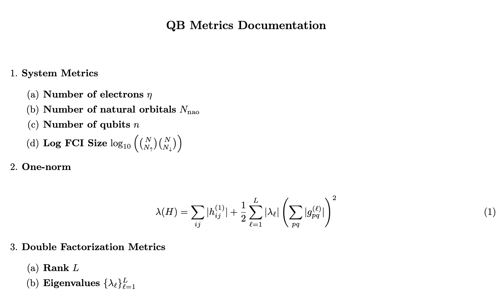
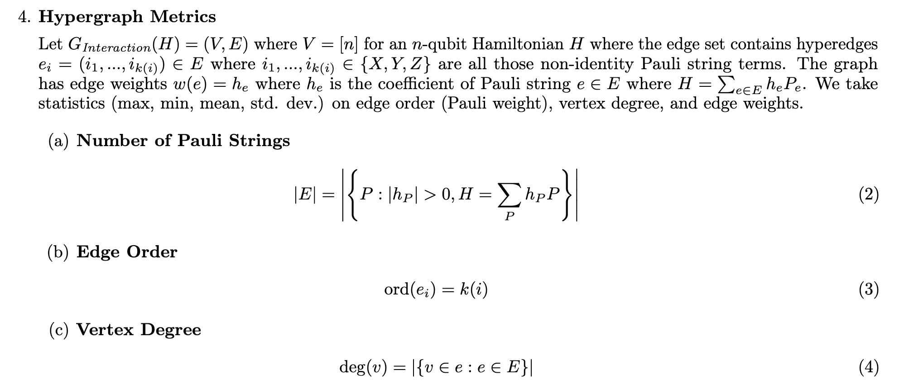
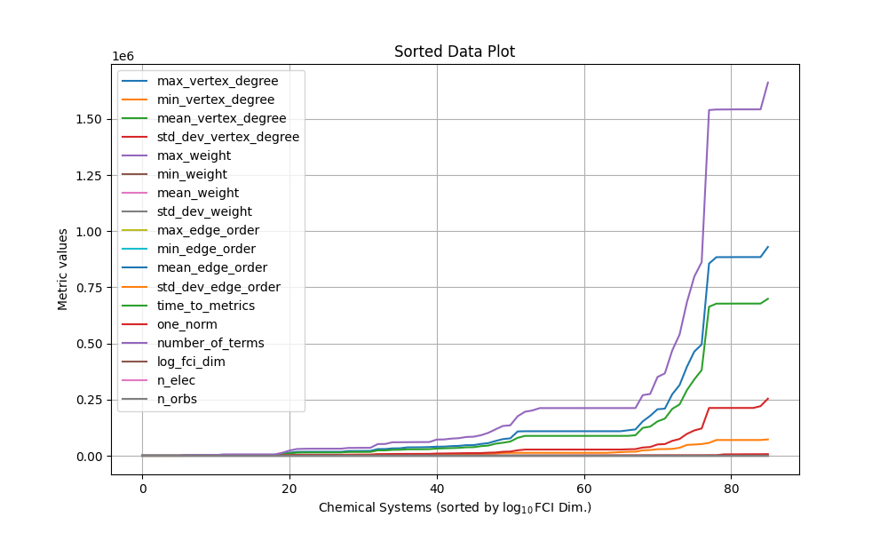

# QB-GSEE-Benchmark

QB-GSEE-Benchmark is a comprehensive suite for benchmarking Ground State Energy Estimation (GSEE) algorithms developed by the DARPA Quantum Benchmarking (QB) Program. This tool enables performers to run a subset of Hamiltonian instances and assess the performance of their algorithms in terms of accuracy, runtime, and hardware utilization.

## License

This project is licensed under the Apache License, Version 2.0 - see the [LICENSE](LICENSE) file for details.

## Acknowledgments

This software was developed as a part of [DARPA Quantum Benchmarking program](https://www.darpa.mil/program/quantum-benchmarking).
