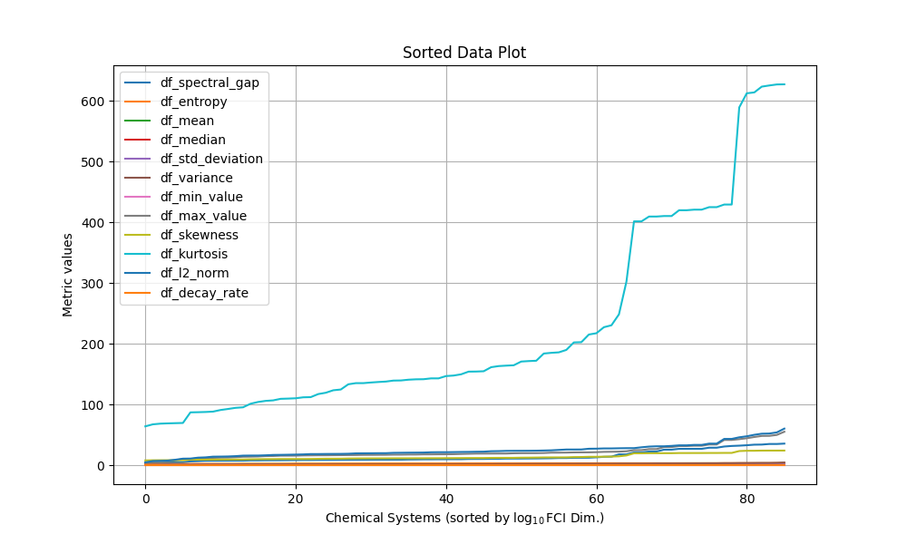

# QB-GSEE-Benchmark

QB-GSEE-Benchmark is a comprehensive suite for benchmarking Ground State Energy Estimation (GSEE) algorithms developed by the DARPA Quantum Benchmarking (QB) Program. This tool enables performers to run a subset of Hamiltonian instances and assess the performance of their algorithms in terms of accuracy, runtime, and hardware utilization.

## What is QB-GSEE-Benchmark?

This repository includes:
- A curated list of Hamiltonian instances for benchmarking, sourced from the [qb-gsee-problem-instances repository](https://github.com/jp7745/qb-gsee-problem-instances).
- Example code to access and process these instances.
- Scripts to evaluate and summarize the performance of GSEE algorithms.

Performers will generate solution files that detail:
- Estimated energies or accuracies
- Computation runtime
- Hardware specifications
- Other relevant metrics

These solution files can then be used with this tool to generate comprehensive performance summaries and interface with the "Bubble ML" GUI for advanced performance exploration.





## Installation

Clone this repository to get started:
```bash
git clone https://github.com/yourusername/qb-gsee-benchmark.git
cd qb-gsee-benchmark
```

<!---
### Requirements

- Python 3.7+
- Necessary Python packages can be installed via:
```bash
pip install -r requirements.txt
```
--->
## Usage

1. **Prepare the Data**:
   Download and prepare the problem instances from the qb-gsee-problem-instances repository. Follow their guide on downloading associated data files.

2. **Running Benchmarks**:
   Execute the benchmark scripts with your solution files:
   ```bash
   python run_benchmark.py solution_file.json
   ```

3. **View Results**:
   After running the benchmarks, generate a summary of performance:
   ```bash
   python summarize_performance.py solution_file.json
   ```

4. **Explore with Bubble ML**:
   Launch the Bubble ML GUI to visualize and explore performance details:
   ```bash
   python bubble_ml_gui.py
   ```

## Contributing

Contributions to the QB-GSEE-Benchmark are welcome! Please consider the following steps:
- Fork the repository.
- Create a feature branch (`git checkout -b feature-branch`).
- Commit your changes (`git commit -am 'Add some feature'`).
- Push to the branch (`git push origin feature-branch`).
- Open a Pull Request.

## License

This project is licensed under the Apache License, Version 2.0 - see the [LICENSE](LICENSE) file for details.

## Acknowledgments

This software was developed as a part of [DARPA Quantum Benchmarking program](https://www.darpa.mil/program/quantum-benchmarking).
